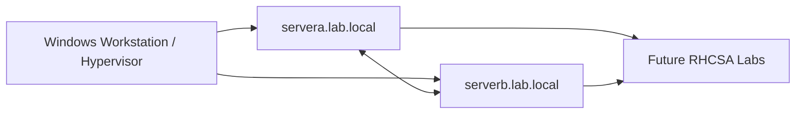

# Lab 01 — Installing Red Hat Enterprise Linux

## 1. Lab Summary

**Lab:** Lab 01 — Installing Red Hat Enterprise Linux  
**Topic area:** RHEL installation, VM build, baseline system verification, lab environment readiness  
**Difficulty:** Beginner foundation, strict evidence standard  
**Status:** Not started / In progress / Completed

### Objective

Build a clean RHCSA practice environment from scratch using two RHEL-family virtual machines. Verify that both systems are installed correctly, reachable, documented, and ready for later RHCSA labs.

This is not a click-through installation note. Treat it as an infrastructure build handover: another engineer should be able to inspect your evidence and understand whether your environment is reliable enough for the rest of the lab series.

---

## 2. Scenario

You are joining a Linux operations team and need to prepare a controlled RHCSA practice environment.

Before you can practise users, permissions, storage, services, SELinux, firewalld, SSH, NFS, systemd, and troubleshooting, you need two clean Linux servers with predictable names, working networking, package repositories, enabled security services, and documented baseline evidence.

Your manager gives you this requirement:

> Build two clean RHEL-family lab servers. Prove they boot, identify themselves correctly, have working networking, can reach package repositories, have SSH available, have SELinux and firewalld present, and survive a reboot without losing the baseline configuration.

---

## 3. Reference Material

Use the reference material to work out the correct steps.

| Area | Suggested reference |
| ---- | ------------------- |
| Primary book chapter | RHCSA 10 Cert Guide, Chapter 1 — Installing Red Hat Enterprise Linux |
| Exam objective area | Deploy, configure, and maintain systems; operate running systems; understand and use essential tools |
| Installation docs | Official Red Hat installation documentation where needed |
| System identity | `man hostnamectl`, `man hostname` |
| Network checks | `man ip`, `man nmcli`, `man resolv.conf` |
| Storage checks | `man lsblk`, `man findmnt`, `man df`, `man swapon` |
| Service checks | `man systemctl`, `man sshd` |
| Package checks | `man dnf`, `man rpm` |
| SELinux checks | `man getenforce`, `man sestatus` |

---

## 4. Requirements

| ID | Requirement | Status |
| -- | ----------- | ------ |
| R1 | Create two RHEL-family virtual machines | Not started |
| R2 | Name the systems `servera.lab.local` and `serverb.lab.local` | Not started |
| R3 | Create a non-root administrative user for lab work | Not started |
| R4 | Verify operating system identity and kernel information | Not started |
| R5 | Verify storage layout, mounted filesystems, and swap state | Not started |
| R6 | Verify IP configuration, default route, and DNS configuration | Not started |
| R7 | Prove both systems can communicate with each other by IP address | Not started |
| R8 | Verify package repositories or package management availability | Not started |
| R9 | Verify SSH service state | Not started |
| R10 | Verify firewalld state | Not started |
| R11 | Verify SELinux state | Not started |
| R12 | Reboot both systems and prove the baseline survives reboot | Not started |
| R13 | Create a build record for the lab | Not started |
| R14 | Capture evidence without exposing secrets or private data | Not started |

---

## 5. Constraints

You must not:

* skip verification after installation
* rely only on the GUI to prove the system state
* disable SELinux
* permanently disable firewalld
* commit passwords, SSH private keys, subscription details, or screenshots containing sensitive account information
* commit RHEL ISO files, PDFs, EPUBs, or copied book material
* proceed to Lab 02 until both systems have been reboot-tested
* mark the lab complete without command evidence

---

## 6. Assumptions

Record your assumptions here.

Examples:

* RHEL 10 is preferred for the lab environment.
* CentOS Stream 10 is acceptable if RHEL access is unavailable.
* The lab is running locally in a hypervisor such as VMware Workstation, VirtualBox, Hyper-V, UTM, or another VM platform.
* The machines use NAT or bridged networking.
* Static addressing is optional in Lab 01, but the chosen addressing must be documented.
* Later labs may require additional disks, packages, and network services.

---

## 7. Expected Structure

Your final environment should look like this:

```text
RHCSA10Labs/
└── labs/
    └── 01-installing-redhat-enterprise-linux/
        ├── README.md
        ├── Lab1-Requirements.md
        └── Lab1-Output.md
```

Your lab systems should look like this:

| System | Purpose | Required hostname |
| ------ | ------- | ----------------- |
| VM 1 | Primary administration target | `servera.lab.local` |
| VM 2 | Remote target for later SSH, networking, storage, and service labs | `serverb.lab.local` |

---

## 8. Deliverables

By the end of the lab, this folder should contain:

| File | Purpose |
| ---- | ------- |
| `Lab1-Requirements.md` | This lab assignment and requirements document |
| `Lab1-Output.md` | Your completed lab report and verification evidence |

Your completed `Lab1-Output.md` should include:

| Evidence area | Minimum evidence expected |
| ------------- | ------------------------- |
| OS identity | `hostnamectl`, `/etc/os-release`, `uname -r` |
| User context | `whoami`, `id`, `groups` |
| Storage | `lsblk`, `lsblk -f`, `df -h`, `findmnt`, `swapon --show` |
| Network | `ip addr`, `ip route`, `nmcli device status`, DNS evidence, ping tests |
| Packages | `dnf repolist` or equivalent package management evidence |
| Services | `systemctl status sshd`, `systemctl status firewalld` |
| Security | `getenforce` or `sestatus` |
| Persistence | repeat key checks after reboot |

---

## 9. Implementation Tasks

Use these tasks as a guide, not as a copy-paste walkthrough.

### Task 1 — Build the virtual machines

Create two RHEL-family VMs.

Minimum expected configuration:

| Setting | Minimum | Preferred |
| ------- | ------- | --------- |
| CPU | 1 vCPU | 2 vCPU |
| RAM | 2 GB | 4 GB |
| Disk | 30 GB | 40 GB or more |
| Network | NAT or bridged | Same network for both VMs |
| Install type | CLI-capable server install | Minimal/server installation |

You need to decide whether to use RHEL or CentOS Stream and document why.

### Task 2 — Set hostnames

Configure the systems so their hostnames are:

```text
servera.lab.local
serverb.lab.local
```

Verify the hostnames from the terminal.

### Task 3 — Create your administrative lab user

Create or verify a normal user account for lab work.

Your evidence must show:

* the user can log in
* the user has the expected shell
* the user can perform administrative tasks through the chosen privilege method
* you did not expose the password in documentation

### Task 4 — Verify operating system identity

On both systems, prove:

* hostname
* operating system release
* kernel version
* architecture if useful

### Task 5 — Verify storage baseline

On both systems, prove:

* disks are visible
* filesystems are mounted
* root filesystem is present
* swap state is known
* mount layout is understood

### Task 6 — Verify networking baseline

On both systems, prove:

* IP address configuration
* default route
* DNS configuration
* NetworkManager connection state
* both machines can communicate by IP address

### Task 7 — Verify package management

Prove that package management works or clearly document why it does not.

At minimum, capture repository or package manager evidence. If repositories are unavailable because of subscription or image choice, document the limitation and how you will handle it in later labs.

### Task 8 — Verify key services and security state

On both systems, check:

* `sshd`
* `firewalld`
* SELinux mode
* default systemd target

Do not disable SELinux or firewalld to make the lab easier.

### Task 9 — Create a build record

Create a short build record in your lab output.

It should include:

| Field | Value |
| ----- | ----- |
| Hypervisor | |
| OS used | |
| ISO/source used | |
| VM names | |
| Hostnames | |
| Network mode | |
| IP addresses | |
| Disk size | |
| Admin user | Do not include password |
| Installation date | |
| Known limitations | |

### Task 10 — Reboot and prove persistence

Reboot both machines.

After reboot, verify again:

* hostnames
* IP addresses
* default route
* SSH service state
* firewalld state
* SELinux state
* package manager/repository state

---

## 10. Key Commands Used

Record the important commands you used.

| Command | Purpose |
| ------- | ------- |
| `hostnamectl` | Verify or set hostname and OS identity |
| `cat /etc/os-release` | Confirm operating system release |
| `uname -r` | Confirm running kernel version |
| `whoami` | Confirm current user context |
| `id` | Confirm UID, GID, and group membership |
| `groups` | Confirm supplementary group membership |
| `lsblk` | Inspect block devices |
| `lsblk -f` | Inspect filesystems and UUIDs |
| `df -h` | Inspect mounted filesystem usage |
| `findmnt` | Inspect mount tree |
| `swapon --show` | Inspect active swap |
| `ip addr` | Inspect IP addresses |
| `ip route` | Inspect routes and default gateway |
| `nmcli device status` | Inspect NetworkManager device state |
| `nmcli connection show` | Inspect NetworkManager connections |
| `cat /etc/resolv.conf` | Inspect DNS resolver configuration |
| `ping` | Test connectivity |
| `dnf repolist` | Verify repository visibility |
| `systemctl get-default` | Verify default systemd target |
| `systemctl status sshd --no-pager` | Verify SSH service state |
| `systemctl status firewalld --no-pager` | Verify firewall service state |
| `getenforce` | Verify SELinux mode |
| `reboot` | Test persistence after restart |

Add or remove commands based on what you actually used.

---

## 11. Files Created or Changed

| Path | Purpose |
| ---- | ------- |
| `labs/01-installing-redhat-enterprise-linux/Lab1-Requirements.md` | Lab requirements and assignment |
| `labs/01-installing-redhat-enterprise-linux/Lab1-Output.md` | Completed lab evidence and reflection |

On the lab VMs, record any files you changed. Do not invent files if you did not change them.

---

## 12. Verification Evidence

This section proves that the lab worked.

| Check | Evidence | Result |
| ----- | -------- | ------ |
| `servera` installed | OS and hostname evidence captured | Passed / Failed |
| `serverb` installed | OS and hostname evidence captured | Passed / Failed |
| Hostnames correct | `hostnamectl` output captured | Passed / Failed |
| Storage baseline known | `lsblk`, `df -h`, `findmnt` captured | Passed / Failed |
| Networking baseline known | `ip addr`, `ip route`, `nmcli` captured | Passed / Failed |
| VM-to-VM connectivity works | ping test captured | Passed / Failed |
| Package management checked | `dnf repolist` or limitation documented | Passed / Failed |
| SSH checked | `systemctl status sshd --no-pager` captured | Passed / Failed |
| firewalld checked | `systemctl status firewalld --no-pager` captured | Passed / Failed |
| SELinux checked | `getenforce` or `sestatus` captured | Passed / Failed |
| Reboot persistence verified | post-reboot checks captured | Passed / Failed |
| No sensitive data committed | evidence reviewed before commit | Passed / Failed |

---

## 13. Diagram

Use this diagram to describe the intended lab environment.



Update the diagram if your final setup differs.

---

## 14. Issues Encountered

Record mistakes, errors, or blockers.

| Issue | Cause | Fix |
| ----- | ----- | --- |
| | | |

If there were no issues, write:

> No major issues encountered.

---

## 15. Decisions Made

Record important technical decisions.

| Decision | Reason |
| -------- | ------ |
| Use two VMs | Later RHCSA labs need remote access, networking, storage, and service/client testing |
| Use `servera.lab.local` and `serverb.lab.local` | Predictable naming makes later labs easier to document and troubleshoot |
| Keep SELinux enabled | RHCSA requires SELinux competence and production systems should not bypass security controls casually |
| Keep firewalld available | Later service labs require firewall configuration and troubleshooting |
| Capture evidence after reboot | RHCSA tasks must persist after reboot where applicable |

Add your own decisions if they differ.

---

## 16. Security and Production Considerations

Explain the production relevance of this lab.

Cover:

* why baseline documentation matters
* why hostnames should be predictable
* why SELinux should not be disabled casually
* why firewalld should remain part of the lab
* why package repository state matters before later work
* why reboot persistence is essential
* why passwords, private keys, subscription details, and screenshots with sensitive data must not be committed

Write your notes in `Lab1-Output.md`.

---

## 17. Final Outcome

State clearly whether the lab was completed.

Example:

> The lab was completed successfully. Two RHEL-family systems were installed, named, verified, reboot-tested, and documented. Baseline evidence confirms that the systems are ready for the next RHCSA lab.

---

## 18. What I Learned

Write 3–6 bullet points.

Examples:

* I learned how to verify the operating system and kernel version from the command line.
* I learned why hostnames matter in multi-server Linux labs.
* I learned how to inspect block devices, mounted filesystems, and swap.
* I learned how to verify NetworkManager state and basic connectivity.
* I learned why SELinux and firewalld should be part of the baseline instead of being disabled.

---

## 19. What I Would Improve in Production

Write 2–5 bullet points.

Examples:

* Use a documented golden image or automated build process.
* Use configuration management to enforce baseline settings.
* Store secrets in a dedicated secrets manager rather than in files or notes.
* Use monitoring to confirm host availability and service state.
* Use central logging for audit and troubleshooting.

---

## 20. References Used

List the references you actually used.

| Reference | Used for |
| --------- | -------- |
| RHCSA 10 Cert Guide, Chapter 1 | Installing Red Hat Enterprise Linux and preparing the practice environment |
| `man hostnamectl` | Hostname and system identity checks |
| `man ip` | Network inspection |
| `man nmcli` | NetworkManager inspection |
| `man lsblk` | Block device inspection |
| `man findmnt` | Mount tree inspection |
| `man dnf` | Repository and package management checks |
| `man systemctl` | Service and target verification |
| `man getenforce` | SELinux mode verification |
| Official Red Hat documentation | Installation and system administration clarification where needed |

---

## 21. Completion Checklist

* [ ] Requirements understood
* [ ] Two RHEL-family VMs created
* [ ] `servera.lab.local` configured
* [ ] `serverb.lab.local` configured
* [ ] Administrative lab user verified
* [ ] OS identity evidence captured
* [ ] Storage evidence captured
* [ ] Network evidence captured
* [ ] VM-to-VM connectivity tested
* [ ] Package manager/repository state checked
* [ ] SSH service checked
* [ ] firewalld checked
* [ ] SELinux checked
* [ ] Reboot persistence verified
* [ ] Issues documented
* [ ] Decisions documented
* [ ] Security considerations documented
* [ ] Diagram added or confirmed
* [ ] Files committed with clear messages
* [ ] Work pushed to GitHub
* [ ] No secrets or private data committed

---

## 22. Reflection Questions

Answer these after completing the lab.

1. Why do you need two systems for a serious RHCSA practice environment?
2. What is the difference between a VM name and a Linux hostname?
3. Why is `hostnamectl` more useful than only checking the shell prompt?
4. What does `lsblk -f` show that plain `lsblk` does not?
5. Why is it important to know whether swap is active?
6. What does the default route tell you?
7. Why is NetworkManager important on modern RHEL systems?
8. Why should you verify package repositories before later labs?
9. Why should SELinux remain enabled during RHCSA practice?
10. Why should firewalld remain available even if no service is exposed yet?
11. What evidence proves that your configuration survived a reboot?
12. What would make this lab output look professional to a hiring manager?
13. What would make this lab output look careless?
14. What information should you avoid committing to GitHub from this lab?
